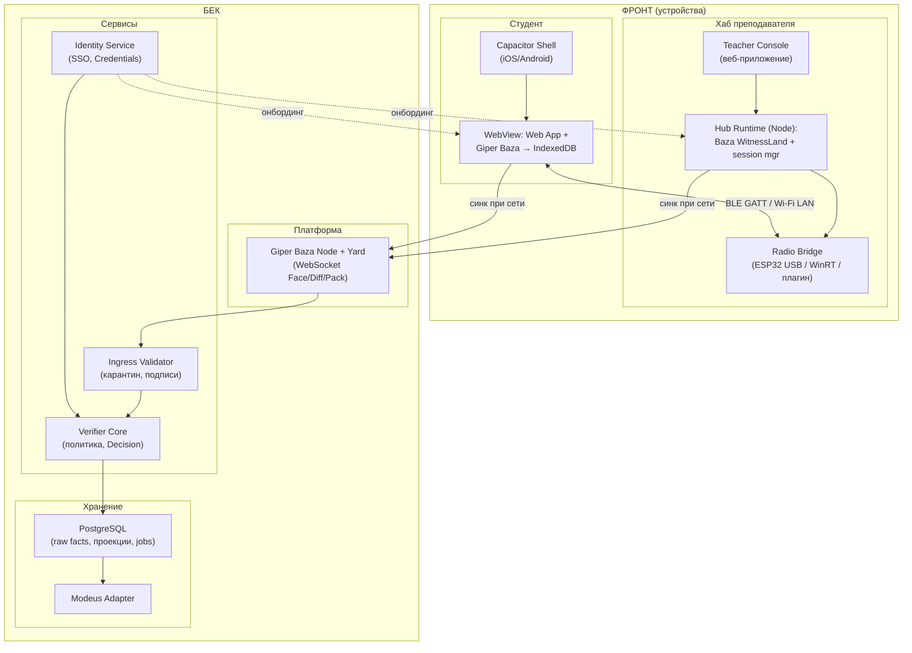

# AttendPro v4: BLE-first архитектура отметок посещаемости

**Версия:** 4.0
**Дата:** 2026-08-19
**Статус:** целевая архитектура. Заменяет транспортную часть v3 (`attendpro-baza-first-v3.md`); сохраняет её модель подписанных фактов, Baza-first хранение и PostgreSQL escape hatch.

**Связанные документы:**

- `attendpro-baza-first-v3.md` — предыдущая архитектура (QR + Baza);
- `2026-08-18-giper-baza-deep-dive.md` — аудит Giper Baza по исходникам;
- `../src/CIT/QR/2026-08-19-giper-baza-linearization-attendance-design.md` — линеаризация, цепочки устройств, модель угроз времени;
- `../src/CIT/QR/2026-08-18-attendpro-local-network-ble-research.md` — исследование локальных каналов;
- Giper Baza, зафиксированный коммит `580afc5793c24b9e28d38872063e18ead2e9d6a8` (master).

---

## 1. Решение

1. **QR-коды убираются** из основного флоу полностью.
2. Канал присутствия — **BLE**: хаб преподавателя рекламирует сессию, студенческое приложение подключается одним нажатием (one-tap).
3. Проблема офлайнового времени решается **witness-механизмом**: доверенный хаб фиксирует получение отметки внутри подписанного окна. Часы студента больше не участвуют в решении о зачёте.
4. **Wi-Fi LAN** — запасной канал объёма на том же хабе.
5. Хранение — **Giper Baza** на всех узлах (обоснование и границы — §10).
6. Идентичность людей — через **SSO-валидатор** университета (§3).

---

## 2. Принципы

1. **Логика первична, платформа вторична.** Флоу = «актор издал подписанный факт с таким содержанием»; та же логика изоморфно ложится на BLE, Wi-Fi LAN или онлайн.
2. **Минимальный state и минимальные пейлоады.** Храним только первичные факты; выводимое — вычисляем. В отметке нет поля времени: время определяется окном якоря.
3. **Минимум локальных проверок.** Телефон студента проверяет офлайн только то, что нельзя отложить (подпись якоря, действительность своего креденшела). Всё остальное проверяет один полный верификатор — синхронизатор, повторяя все проверки сам (zero-trust к устройствам).
4. **Минимум акторов и сущностей.** Четыре актора, семь типов фактов. Новая сущность оправдывается фатальной необходимостью.
5. **Идентичность факта = где лежит + что содержит + кем подписан.** Идентификатор факта — SHA-256 его канонических байтов; отдельные uuid — только там, где на них ссылается кто-то другой.
6. **Свидетель времени — только доверенное устройство в окне.** Никогда — часы студента, `Unit.time`, RSSI или факт «услышал маяк» по отдельности.

---

## 3. Акторы

| Актор | Кто это | Чем владеет | Что издаёт |
|---|---|---|---|
| **Студент** | Человек с зарегистрированным устройством | Ключ устройства, `DeviceCredential` | `Mark` |
| **Преподаватель** | Человек, ведущий пару; владелец хаба | Ключ хаба, `TeacherCredential` | `SessionAnchor`, `Receipt`, `WitnessBatch` |
| **SSO-валидатор** | Университетская identity-система (актор подтверждён: без него невозможно связать ключ устройства с конкретным человеком из контингента) | Ключ университета | `DeviceCredential`, `TeacherCredential` |
| **Синхронизатор** | Zero-trust верификатор и проектор | Ключ синхронизатора | `Decision` |

**Про авторизацию по учётке (ответ на вопрос):** да, авторизация будет. Приложение студента и преподавателя при первом запуске прогоняет пользователя через университетский SSO (OIDC/аналог); SSO-валидатор — отдельный актор, потому что только он уполномочен сказать «этот публичный ключ принадлежит студенту X из группы Y». Без этой привязки система отметок вырождается в «кто угодно отметился за кого угодно». Синхронизатор — тоже актор со своим ключом: он подписывает вердикты и является единственным, чьи решения меняют официальную посещаемость.

Администратор — **не отдельный актор**: исправления (спорные случаи, больничные) оформляются как workflow синхронизатора с отдельным подписанным фактом-переопределением, ссылающимся на исходный `Mark` и вердикт; история не переписывается.

---

## 4. Подписанные факты — логическая схема

### 4.1 Общий конверт

Каждый факт — канонически закодированная структура (RFC 8785 JCS), подписанная ES256 по доменно-разделённым байтам:

```text
FactEnvelope {
  v: 1                      // версия протокола
  kind: "anchor" | "mark" | "receipt" | "batch"
       | "device_cred" | "teacher_cred" | "decision"
  body: { ... }             // поля вида, см. ниже
  sig: ES256( SHA-256( "attendpro.fact.v1" || v || kind || canonical(body) ) )
}
fact_hash = SHA-256(canonical envelope без поля sig)
```

Идентичность факта — `fact_hash`. Ссылки между фактами — только хэшами (принцип 5).

### 4.2 Четыре факта, которые летят в аудитории

**F1. SessionAnchor** — подписант: хаб (ключ преподавателя).

```text
body {
  session_id        // ид пары (один на всё занятие)
  epoch_index       // номер эпохи (ротация каждые N минут, стартовое N = 5)
  epoch_nonce       // 128-бит случайный — защищает от replay между парами
  prev_anchor_hash  // хэш предыдущего якоря — цепочка якорей внутри пары
  hub_key_id        // отпечаток ключа хаба
  policy_hash       // хэш версии правил приёма
}
```

**F2. Mark** — подписант: студент (ключ устройства).

```text
body {
  anchor_hash       // на какой якорь отвечаю
  credential_hash   // мой DeviceCredential (кто я)
  mark_nonce        // случай — уникальность и защита от дублей
}
```

Поля времени **нет** — принцип 2. Заявленное студентом время ничего не доказывает и не хранится как первичный факт.

**F3. Receipt** — подписант: хаб.

```text
body {
  mark_hash         // какую отметку получил
  anchor_hash       // в какой эпохе получил
  receive_seq       // порядковый номер приёма в этой паре (монотонный у хаба)
  epoch_state: "open"
}
```

**F4. WitnessBatch** — подписант: хаб. Создаётся при закрытии пары.

```text
body {
  session_id
  final_epoch_index
  merkle_root       // Merkle-корень всех принятых mark_hash
  count             // сколько отметок
  final_receive_seq
  prev_batch_hash   // если пары закрываются партиями
}
```

### 4.3 Факты онбординга и вердиктов

**F5. DeviceCredential** — подписант: SSO-валидатор.

```text
body { university_id, device_pubkey, valid_from, valid_until, policy_version }
```

**F6. TeacherCredential** — подписант: SSO-валидатор.

```text
body { teacher_id, hub_pubkey, role, scope (аудитории/дисциплины или "*"), valid_until }
```

**F7. Decision** — подписант: синхронизатор.

```text
body {
  mark_hash
  verdict: "accepted" | "rejected" | "needs_review"
  reason_codes: []  // NO_WITNESS | DUPLICATE | CREDENTIAL_EXPIRED | ...
  policy_version
}
```

### 4.4 Как факты ложатся в радио

BLE advertising-пакет — 31 байт, полная подпись туда не влезает. Поэтому:

```text
в эфире (advertising):  service UUID «AttendPro» + короткий session_handle + epoch_index
по GATT:                challenge-характеристика отдаёт полный подписанный F1;
                        mark-характеристика принимает F2 (фрагментация при необходимости);
                        receipt-характеристика (notify) возвращает F3.
```

Студент обязан криптографически проверить F1 **до** создания F2 — это одна из немногих локальных проверок (принцип 3).

---

## 5. BLE: роли и радиопротокол

```text
Хаб (peripheral, GATT-server)          Студент (central, GATT-client)
  │ reklama: UUID + handle + epoch  ──────► слушает скан
  │ ◄────── connect (после one-tap) ───────┐
  │ challenge (read)  ───────────────────► читает F1, проверяет подпись
  │ ◄── mark (write, ~200–400 байт) ────── пишет F2
  │ receipt (notify)  ───────────────────► получает F3, disconnect
```

Правила:

1. **Кричит только хаб.** Один рекламодатель + сотни слушающих — самая лёгкая радио-конфигурация; проблемы коллизий многих рекламодателей не возникает.
2. **Соединения короткие:** connect → read → write → notify → disconnect, с джиттером (случайной паузой) и экспоненциальным откатом при неудаче. Постоянные соединения запрещены — хаб не держит состояние на сотнях клиентов.
3. **Mesh запрещён на пути отметки.** Только один прямой хоп до хаба: ретрансляция чужими телефонами уничтожает доказательство близости (подпись доказывает авторство, а не близость — см. §9).
4. **Ротация эпох:** якорь F1 перевыпускается каждые N минут (параметр, старт 5), `prev_anchor_hash` сшивает их в цепочку; отметка обязана ссылаться на текущую или последнюю открытую эпоху — опоздавшие отмечаются в поздних эпохах тем же флоу.
5. **Энергопотребление:** радио у студента включено на ~10–30 секунд one-tap-сессии. Фоновый скан — опция (v2 UX), не требование: Android — PendingIntent-скан в окно пары по расписанию, iOS — локальное напоминание без скана. Расписание уже подписано и скачано заранее; геолокация не используется.

---

## 6. Хаб преподавателя: три варианта реализации

### Вариант А — встроенный Bluetooth ноутбука + нативная прослойка

Windows умеет рекламить (API `BluetoothLEAdvertisementPublisher`) и быть GATT-сервером (`GattServiceProvider`, Windows 10 1803+).

- **Как реализовано:** маленький нативный tray-модуль/Electron-компонент рядом с веб-консолью преподавателя; радио — штатный адаптер ноутбука.
- **Риски:** BLE-стек Windows легендарно средний, зависит от драйвера адаптера; на части машин advertising ограничен; Web Bluetooth не помогает в принципе — стандарт не умеет peripheral-роль даже в Chrome.
- **Вердикт:** допустимо для пилота; не основа для масштабирования.

### Вариант Б — ESP32-свисток в USB (рекомендуемый)

Платка ESP32/ESP32-S3 (~5–8$) втыкается в любой ПК, даже без Bluetooth. Вся радиочасть (реклама якоря, приём отметок GATT) живёт на платке; ПК общается с ней по USB как с модемом (простой line-протокол: «начни пару», «вот полный якорь», «принял отметку», «закрой эпоху»).

- **Плюсы:** радио гарантировано на любом железе; независимость от Windows-драйверов; опционально — ключ в защищённом железе платки (eFuse/HMAC: одноразовая память чипа, откуда секрет не извлекается); та же платка ставится стационарно в аудиторию без ПК; дёшево масштабируется на все аудитории.
- **Как реализовано:** прошивка ESP32 (C++/Arduino или ESP-IDF), консоль преподавателя — вкладка нашего веб-приложения, говорящая со свистком через Web Serial/USB.
- **Вердикт:** основной вариант для пилота и production.

### Вариант В — телефон преподавателя как хаб

Работает, но Capacitor-плагин `@capacitor-community/bluetooth-le` central-only, поэтому рекламить с телефона нужен кастомный нативный плагин (на iOS — `CBPeripheralManager`; пишется, но это отдельная разработка и поддержка).

- **Вердикт:** фолбэк «ничего не завезли», не основной путь.

### Сводная таблица

| | А: BT ноутбука | Б: ESP32-свисток | В: телефон препода |
|---|---|---|---|
| Радио | зависит от драйвера | гарантировано | зависит от ОС-фона |
| Дополнительное железо | нет | платка ~5–8$ | нет |
| Ключ в защищённом железе | нет | да (eFuse) | частично (keystore) |
| Стационарная установка без ПК | нет | да | нет |
| Затраты на ПО | нативная прослойка Win | прошивка + USB-протокол | кастомный Capacitor-плагин |
| Роль | пилот | **основной** | фолбэк |

---

## 7. Wi-Fi LAN — запасной канал объёма

Тот же хаб (ESP32 умеет и Wi-Fi, и BLE одновременно; либо ПК) раздаёт открытую точку `AttendPro-312` **без Интернета**. Логика идентична, меняется только транспорт:

```text
студент услышал BLE-маяк (фактор близости — обязателен!)
  → подключился к Wi-Fi хаба (системный диалог)
  → POST http://192.168.4.1/mark  { F2 }
  → 200 { F3 Receipt }            — тот же подписанный факт
```

- **Роль:** разгрузка объёма (HTTP-сервер тянет десятки запросов/сек; тремстам студентам хватит пары минут), ремонтный канал при проблемах GATT, канал для «тяжёлых» операций в будущем.
- **Ограничения:** подключение к сети — ручной шаг с диалогом ОС; вузовский Wi-Fi с client isolation не годится — только своя точка хаба; BLE-маяк остаётся обязательным условием приёма (Wi-Fi один не доказывает комнату).
- **PWA-нюанс:** в браузере нужен HTTPS + разрешение Local Network Access; в Capacitor-оболочке этих проблем нет — поэтому Wi-Fi LAN идёт в паре с нативной оболочкой.

---

## 8. Полные флоу

### 8.1 Онбординг студента (онлайн, раз в семестр / новое устройство)

```text
1. Студент ставит приложение, логинится через университетский SSO.
2. Устройство генерирует пару ключей (приватный — в защищённом хранилище ОС).
3. SSO-валидатор проверяет учётку и издаёт F5 DeviceCredential:
   «публичный ключ K принадлежит студенту X до конца семестра».
4. Синхронизатор создаёт StudentEvidenceLand, выдаёт устройству право post.
5. Приложение скачивает: свой креденшел, публичные ключи доверия
   (университет, актуальные TeacherCredential-хэши), своё расписание.
6. Создаётся Genesis-событие стрима устройства (для цепочки второго эшелона).
```

### 8.2 Онбординг преподавателя и хаба (онлайн, раз в семестр)

```text
1. Преподаватель логинится через SSO на консоли хаба.
2. Хаб генерирует ключ; SSO-валидатор издаёт F6 TeacherCredential
   (роль, scope аудиторий, срок).
3. К хабу подключается радио (ESP32-свисток / BT ноутбука).
4. Хаб скачивает: свой креденшел, свежий snapshot отозванных
   студенческих креденшелов (для офлайн-проверки допуска).
```

### 8.3 Открытие пары (преподаватель, офлайн)

```text
1. Преподаватель выбирает пару в консоли → «Начать занятие».
2. Хаб создаёт SessionAnchor F1 (epoch_index=0, свежий nonce),
   подписывает, кладёт в свой WitnessLand (Giper Baza).
3. Радио начинает рекламу: UUID «AttendPro» + session_handle + epoch.
4. Каждый N минут — новая эпоха: новый F1 со ссылкой на предыдущий.
```

### 8.4 Отметка студента (главный UX, офлайн)

```text
1. Студент открывает приложение (или тапает в напоминание из расписания).
2. Приложение сканирует эфир ~2–5 сек → «Найдена пара “Алгоритмы”, ауд. 312».
   [опция v2: приложение в фоне само услышало и показало уведомление]
3. Тап «Отметиться» → GATT-подключение к хабу (с джиттером при толпе).
4. Читает полный F1, проверяет: подпись хаба в цепочке доверия университета,
   эпоха не закрыта, свой F5 действителен.            ← локальные проверки
5. Создаёт F2 Mark в своей StudentEvidenceLand (Giper Baza, новый self),
   подписывает, пишет в mark-характеристику.
6. Хаб проверяет подпись студента и допуск по snapshot, запоминает mark_hash
   в своей Baza, инкрементирует receive_seq.
7. Хаб возвращает F3 Receipt → студент сохраняет его в свой Land.
   UI: «✓ Принято преподавателем». Disconnect.
```

UX-состояния приложения (инвариант): «занятие найдено» → «сохранено локально» → «**принято хабом — Receipt есть**». Зелёная галочка официальной отметки появляется только после Receipt.

### 8.5 Середина пары

Ротация эпох продолжается автоматически; опоздавшие проходят тот же флоу 8.4 с текущим якорём. Преподаватель в консусе видит счётчик принятых отметок и список (или только счётчик — приватность решается отдельно).

### 8.6 Закрытие пары

```text
1. Преподаватель → «Завершить занятие». Хаб выпускает последний якорь
   с признаком закрытия.
2. Хаб строит Merkle-дерево из всех принятых mark_hash и подписывает
   F4 WitnessBatch; сохраняет в WitnessLand.
3. Студенты, отмечавшиеся успешно, уже имеют Receipt; подтверждение
   включённости в Batch (inclusion proof) доступно позже из синхронизатора.
```

### 8.7 Синхронизация (когда появится любая сеть)

```text
Хаб онлайн:
  WitnessLand (Giper Baza) → дельта-синк Face/Diff/Pack → синхронизатор.

Синхронизатор (zero-trust, повторяет ВСЁ сам):
  1. ingress-карантин: распаковка Pack, проверка подписей Seals/конвертов
     ДО применения к официальной реплике;
  2. проверка TeacherCredential, цепочки якорей, непрерывности receive_seq;
  3. проверка каждого Mark: подпись студента, действующий F5,
     отметка внутри открытой эпохи, отсутствие дубля;
  4. сопоставление Mark ↔ Receipt ↔ Batch (Merkle-inclusion);
  5. издание F7 Decision в DecisionLand;
  6. проекция в PostgreSQL, экспорт в Modeus.

Студент онлайн:
  StudentEvidenceLand → синк → студент получает свой Decision
  («принято» / «needs_review» с причиной) как реплицировавшийся факт.
```

### 8.8 Спор («почему мне не зачли»)

Студентская сторона хранит: F2 (своя подпись) + F3 (подпись хаба). Синхронизаторная: F4 Batch + все Mark. Диспут сводится к проверяемым вопросам: есть ли Receipt, входит ли mark_hash в Batch, была ли эпоха открыта, действовал ли креденшел. Всё проверяется криптографически; ничьё слово не требуется.

### 8.9 Деградационная лестница

```text
1. BLE GATT one-tap (основной)
2. нет GATT → Wi-Fi LAN хаба, те же F2/F3
3. радио не пошло → provisional-отметка локально + ручное подтверждение
   преподавателем в консоли (подписанный TeacherAttestation) 
4. ничего нет → обычная online-отметка через синхронизатор (только
   для случая «сеть есть» — своевременность определяет сервер)
5. Giper Baza недоступна → PostgreSQL online-only backend на тех же
   подписанных конвертах (escape hatch v3 сохраняется)
```

Правило лестницы: деградация доставки не ослабляет правило времени — без своевременного witness-факта отметка не становится «принятой», а получает статус `needs_review`.

---

## 9. Модель угроз: что решает BLE-witness и что нет

| Атака | Статус | Механизм |
|---|---|---|
| Перевод часов / запись в прошлое | ✅ решено | окно якоря + Receipt; время студента не участвует |
| Отметка из дома без сообщников | ✅ решено | нет радио-контакта — нет Receipt |
| Replay чужого якоря/отметки | ✅ решено | nonce эпохи + уникальность mark_hash |
| Поддельный хаб | ✅ решено | студент проверяет цепочку доверия SSO до создания Mark |
| Поддельный студент / Sybil | ✅ решено | F5 DeviceCredential + офлайн-snapshot у хаба |
| Дубль отметки | ✅ решено | уникальность (credential, session); дубль отвергается |
| Сообщник принёс телефон студента | ⛔ не решено радио | proxy-риск уровня бумажной ведомости; закрывается выборочными визуальными проверками |
| Relay/wormhole (радио-туннель) | ⛔ не решено чистым BLE | крипто-ответ — Channel Sounding (BT 6.0) / UWB как второй фактор будущего парка устройств |
| Скомпрометированный ключ хаба | ⚠️ смягчение | ключ в eFuse ESP32 / keystore; аномалии Batch против roster у синхронизатора |

Подпись **не доказывает близость** — ретранслятор честно пересылает подписанные байты. Единственный криптографический ответ relay — измерение времени полёта сигнала (Channel Sounding RTT, UWB). Отсюда запрет mesh на пути отметки.

---

## 10. Хранение: Гипер База — обоснование выбора

### 10.1 Что мы у неё берём

| Фича | Что это | Зачем нам |
|---|---|---|
| Подписанные неизменяемые Unit + Seal | хэш всех байтов записи + подпись автора, привязанная к Land | tamper-evidence «на полке»: подписанное нельзя тихо поправить |
| Lands + Gifts | изолированные домены с правами | per-student evidence-ленды; синхронизатор доставляет Decision в ленд студента офлайн |
| Face/Diff/Pack дельта-синк | готовый бинарный протокол «только новое» поверх WebSocket | этап «хаб очнулся в сети → стекал всё синхронизатору» без самописного outbox |
| HLC (time·2¹⁶+tick) | монотонные часы на юните | бесплатный предохранитель честного клиента + телеметрия второго эшелона |
| Один движок: браузер (IndexedDB) + Node (файлы) | — | телефон студента, хаб, синхронизатор — один формат и код проверки |

### 10.2 Что мы НЕ используем (честно)

1. **CRDT-слияние как таковое почти не задействовано.** У нас писатели не пересекаются: студент пишет только свои события, хаб — свои, синхронизатор — вердикты. Это append-only множества с непересекающимися авторами — сойдётся даже простая union-логика. Магия конфликтов нам почти не нужна.
2. **Шифрование Land'ов не берём в MVP.** Прятать нечего (в эфире только анонимные маяки; отметки идут по шифрованному самому Bluetooth каналу); это упрощает раздачу прав.
3. **База не источник политик.** Она принимает всё подписанное с правами (в `diff_apply` нет бизнес-проверок — проверено по исходникам): валидатор — наш код над ней.

### 10.3 Почему не альтернативы

- **Голый IndexedDB + свой outbox (стиль v2.1):** три самописных слоя — целостность, права, синхронизация; офлайн-хабу нужен свой синк. Дублирует то, что в Базе есть.
- **Automerge/Yjs:** сила — коллективное редактирование документов; у нас — события. Без подписей, без прав, без доставки; строить вокруг них придётся всё то же самое.
- **«Писать всё сразу на хаб, у студента не хранить»:** убивает требование «у студента локальные доказательства», делает хаб единой точкой отказа, теряет встречную подпись.

### 10.4 Ленд-топология

```text
StudentEvidenceLand (per студент)   — King: синхронизатор; post: устройство студента
    Mark, Receipt, AnchorObserved, доставленные Decision

WitnessLand (per хаб)              — King: синхронизатор; post: хаб
    SessionAnchor-цепочки, принятые Mark, Receipt, WitnessBatch

IdentityLand                       — King: синхронизатор; пишет SSO-валидатор
    DeviceCredential, TeacherCredential, отзывные списки

AuditLand + DecisionLand           — King: синхронизатор
    сырые принятые байты IngestObserved, Decision, переопределения
```

Второй эшелон (из документа о линеаризации) сохраняется: каждое событие — новый `self`, прикладная цепочка `stream_seq + prev_event_hash`, ingress-карантин до официальной реплики. Это защита в глубину, не основной щит: основной щит — witness.

### 10.5 Страховочная дверь

Конверты фактов самодостаточны: подписи — прикладные, транспорт — сменный, хранилище — заменяемое. Если База подведёт — факты переезжают в PostgreSQL/SQLite без потери доказательности; синхронизация деградирует до online-only. Выбор Базы — не дверь в одну сторону.

---

## 11. Контейнерная архитектура

Жёсткое разделение **бэк / фронт**; внутри бэка — **платформа (Giper Baza) / сервисы / хранение**.



### Описания контейнеров

**Фронт**

| # | Контейнер | Что это / ответственность | Реализация |
|---|---|---|---|
| C1 | **Capacitor Shell** | Нативная оболочка: даёт веб-коду доступ к BLE central-роле, разрешениям, фоновым режимам ОС | Capacitor + плагин `@capacitor-community/bluetooth-le` (central-only — достаточно: студенты не рекламируются) |
| C2 | **Student Web App** | Весь UI и логика студента: скан → проверка якоря → Mark → Receipt; хранит доказательства локально | Тот же веб-код, что и PWA; Giper Baza в WebView → IndexedDB; в браузере без натива — онлайн-режим (Web Bluetooth на Android — опциональный бонус) |
| C3 | **Teacher Console** | Панель преподавателя: начать/закрыть пару, счётчик отметок, ручные подтверждения | Вкладка веб-приложения на ПК хаба (или RPi с экраном) |
| C4 | **Hub Runtime** | Мозг хаба: генерация цепочек якорей, приём Mark, выдача Receipt, WitnessBatch; офлайн-хранение | Node.js + Giper Baza (WitnessLand, файловое `mine.node.ts`) |
| C5 | **Radio Bridge** | Радио-модем хаба: реклама UUID+handle+epoch, GATT-сервер (challenge/mark/receipt), опционально Wi-Fi AP | Основной: прошивка ESP32 + USB line-протокол; фолбэки: WinRT-модуль (вариант А), кастомный Capacitor-плагин peripheral (вариант В) |

**Бек**

| # | Контейнер | Что это / ответственность | Реализация |
|---|---|---|---|
| C6 | **Giper Baza Node + Yard** | Платформа репликации: приём Pack от хабов и студентов по WebSocket, хранение юнитов всех лендов | Giper Baza в Node; relay/Yard; пикнутый коммит |
| C7 | **Ingress Validator** | Пропускной пункт: разбор и проверка подписей/правил ДО применения к официальной реплике; карантин мусора и атак | Наш сервис над Pack API (admission-слой, которого нет в Базе) |
| C8 | **Verifier Core** | Единственный полный верификатор (zero-trust): повторяет все проверки, издаёт Decision, строит проекции | Наш сервис; общий код проверки конвертов с клиентом (shared protocol core) |
| C9 | **Identity Service** | SSO-адаптер и нотариус креденшелов: привязка учёток к ключам, выдача/отзыв F5/F6 | OIDC-интеграция с университетским SSO + наш issuer |
| C10 | **PostgreSQL** | Доказательное зеркало: raw-факты, Decisions, перестраиваемые проекции, job-очереди | SQL-схема из v3 (raw_facts / decisions / projection / jobs) |
| C11 | **Modeus Adapter** | Экспорт официальной посещаемости в Modeus | Обёртка над API Modeus, идемпотентные jobs |

---

## 12. План полигона (первая проверка до фиксации схемы)

Железо: ноутбук, 2 телефона (iPhone + Android), ESP32-S3.

Измерения: latency обнаружения маяка (p50/p95); вероятность успешного GATT-цикла; пропускная способность отметок/мин при 2/10/30 эмулированных клиентах с джиттером; поведение в кармане/сумке/за стеной; расход батареи one-tap-сессии; повторное подключение после потери радио.

Атаки на полигоне: replay якоря;洪水 mark-запросов; двойная отметка; отметка с просроченным креденшелом; два устройства с одним креденшелом.

---

## 13. Открытые вопросы

1. Ёмкость самой большой аудитории (30? 150? 500?) — определяет, нужен ли Wi-Fi LAN в день пилота.
2. Приватность списка у консоли преподавателя (полный список vs счётчик).
3. Параметр ротации эпох N (старт 5 мин) — баланс защита/шум.
4. Условие включения Channel Sounding/UWB как второго фактора (парк устройств?).
5. Регламент ручных подтверждений (TeacherAttestation) — кто и когда вправе.
6. Отзыв креденшелов офлайн: допустимый срок жизни snapshot на хабе.
7. Развёртывание Identity Service: существующий SSO университета или Keycloak.
8. Матрица поддержки стендовых телефонов для пилота (поколения iOS/Android, Xiaomi-агрессия к фону).
