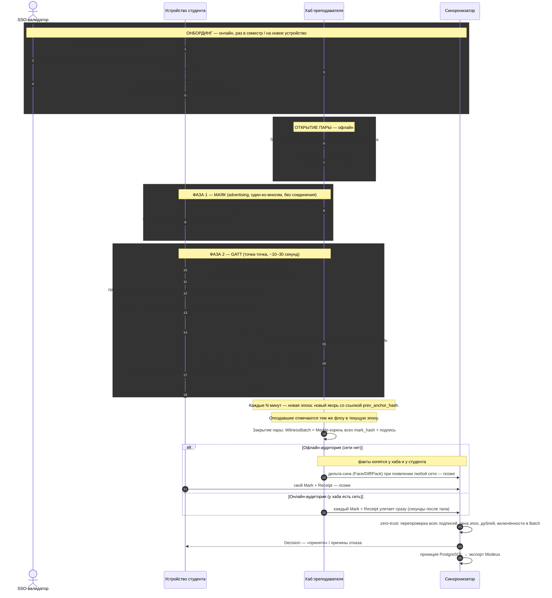

# AttendPro v4: sequence-диаграмма полного цикла отметки

**Дата:** 2026-08-19
**Связанные документы:** `attendpro-ble-first-v4.md` (архитектура), `AttendPro_v4_speech.md` (речь)
**Роли:** SSO-валидатор · устройство студента · хаб преподавателя · синхронизатор

---

## Диаграмма

---

## Подробное описание по этапам

### 1. Онбординг (шаги 1–5) — онлайн, один раз за семестр

Единственный этап, требующий Интернета и человек-идентификации. Студент логинится через университетский SSO; валидатор — единственный актор, уполномоченный связать публичный ключ устройства с конкретным человеком из контингента — выпускает `DeviceCredential`: подписанную связку «этот ключ = этот студент, действителен до конца семестра». Аналогично преподаватель получает `TeacherCredential` для ключа своего хаба. Всё дальнейшее работает офлайн: у студента локально лежат ключи, креденшелы и подписанное расписание (оно потом питает напоминания «сейчас пара» — без геолокации).

### 2. Открытие пары (шаги 6–7) — офлайн

Преподаватель тыкает «начать занятие». Хаб генерирует `SessionAnchor`: идентификатор пары, номер эпохи, случайный nonce на 128 бит (защита от replay между парами) — и подписывает своим ключом. Якорь сохраняется в WitnessLand хаба (это его свидетельская книга). Обратите внимание: время открытия пары нигде не «спрашивается» у студента — окно задаёт сам хаб.

### 3. Фаза 1 — маяк (шаги 8–9) — advertising, один-ко-многим

Хаб начинает ежесекундно выкрикивать в эфир крошечный пакет: UUID сервиса «AttendPro» + короткий идентификатор сессии + номер эпохи. Это **не соединение**: хаб не знает, кто услышал, и не тратит ресурсы на слушателей. Сотни телефонов одновременно сканируют эфир 2–5 секунд, фильтруя по UUID и session_handle (чужой маяк из соседней аудитории игнорируется). Результат фазы — надпись «Пара найдена» и готовность студента тапнуть. Услышать маяк ≠ отметить: отметка рождается только в фазе 2.

### 4. Фаза 2 — GATT-соединение (шаги 10–18) — точка-точка, 10–30 секунд

Студент тапает «Отметиться». Телефон подключается к хабу (при толпе — со случайной паузой-джиттером, чтобы не ломиться всей очередью в одну секунду). Дальше короткий диалог по трём характеристикам:

- **read challenge:** студент получает полный подписанный якорь и проверяет две вещи — подпись хаба в цепочке доверия университета и действительность собственного креденшела. Это единственные локальные проверки во всей системе: всё остальное перепроверит синхронизатор.
- **write mark:** студент создаёт `Mark` — {хэш якоря, хэш своего креденшела, случайный nonce} — и подписывает приватным ключом устройства. Поля времени в отметке **нет**: своевременность будет доказана квитанцией, а не заявлением студента.
- **notify receipt:** хаб проверяет подпись студента, допуск по офлайн-snapshot'у отозванных креденшелов и отсутствие дубля; инкрементирует монотонный `receive_seq` и возвращает `Receipt` — свою подпись под «получил эту отметку, пока окно открыто». Студент сохраняет у себя **пару доказательств**: свой Mark + Receipt хаба. Отключение.

### 5. Ротация эпох и закрытие пары

Пока идёт пара, якорь перевыпускается каждые N минут, каждый новый ссылается хэшем на предыдущий — это «QR-ротация по радио», закрывающая запись в прошлое внутри пары. Опоздавшие проходят тот же флоу с текущим якорем. При закрытии хаб собирает Merkle-дерево из хэшей всех принятых отметок и подписывает `WitnessBatch` — итоговое свидетельство пары.

### 6. Синхронизация — две ветки одного кода

- **Офлайн:** факты копятся у хаба и у каждого студента. Когда появляется любая сеть (преподаватель дошёл до Wi-Fi, студент очнулся вечером) — дельта-синхронизация (протокол Face/Diff/Pack Гипер Базы) привозит всё синхронизатору.
- **Онлайн:** тот же синк, запущенный немедленно — каждый Mark и Receipt улетает серверу через секунды после тапа. Это не отдельный режим, а нулевая задержка того же механизма.

### 7. Верификация и решение (шаги 22–24)

Синхронизатор — единственный full-trust-none верификатор: он **повторяет все проверки сам** (zero-trust к устройствам): подписи всех четырёх сторон, окна эпох, уникальность отметок, включённость каждого mark_hash в Merkle-корень Batch. По результату издаёт `Decision` — «принято» или отказ с кодом причины (NO_WITNESS, DUPLICATE, CREDENTIAL_EXPIRED…) — и доставляет его студенту как реплицировавшийся факт. Дальше детерминированная проекция в PostgreSQL и экспорт посещаемости в Modeus.

### 8. Спор (не на диаграмме — по требованию)

Когда студент говорит «я был, а мне не зачли», ни чьё слово не нужно: его устройство предъявляет Mark (своя подпись) и Receipt (подпись хаба); синхронизатор сверяет mark_hash с Batch и журналом receive_seq. Каждая сторона спора владеет своей половиной криптографического доказательства — в этом смысл двойной записи.
